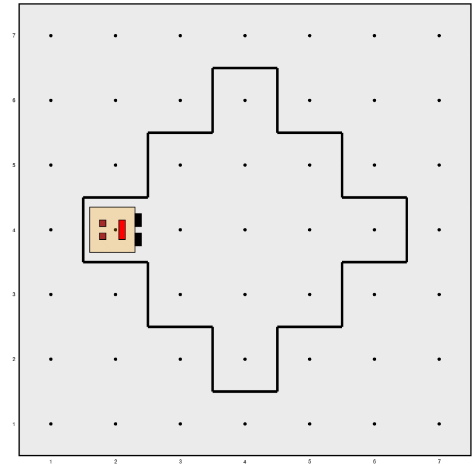
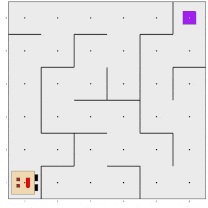

<!-- README.md is generated from README.Rmd. Please edit that file -->

```{r, include = FALSE}
knitr::opts_chunk$set(
  collapse = TRUE,
  comment = "#>",
  fig.path = "man/figures/README-",
  out.width = "50%", 
  fig.align = "center"
)
```

# La robot Karel / Karel the robot 

<!-- badges: start -->

[](https://lifecycle.r-lib.org/articles/stages.html) [](https://CRAN.R-project.org/package=karel)

<!-- badges: end -->

## ¿Quién es Karel? / Who is Karel?

ESTE PAQUETE IMPLEMENTA en R a *Karel the robot*, un lenguaje de programación
creado por el Dr. R. E. Pattis en la Universidad de Stanford en 1981. Karel es
una herramienta útil para enseñar conceptos introductorios sobre programación,
como descomposición algorítmica, declaraciones condicionales, bucles, etc., de
una manera interactiva y divertida, mediante la escritura de programas para que
Karel el robot logre ciertas tareas en el mundo en el que vive. Originalmente
basado en Pascal, Karel fue implementado en muchos lenguajes a lo largo de estas
décadas, incluyendo Java, C++, Ruby y Python. Este es el primer paquete que
implementa a Karel en R.

------------------------------------------------------------------------

This is the R implementation of Karel the robot, a programming language created
by Dr. R. E. Pattis at Stanford University in 1981. Karel is an useful tool to
teach introductory concepts about general programming, such as algorithmic
decomposition, conditional statements, loops, etc., in an interactive and fun
way, by writing programs to make Karel the robot achieve certaing tasks in the
world she lives in. Originally based on Pascal, Karel was implemented in many
languages through these decades, including Java C++, Ruby and Python. This is
the first package implementing Karel in R.

## Instalación / Installation

Podés instalar `karel` desde [CRAN](https://CRAN.R-project.org/package=karel) /
You can install `karel` from [CRAN](https://CRAN.R-project.org/package=karel):

``` r
install.packages("karel")
```

También podés instalar la versión en desarrollo desde
[GitHub](https://github.com/mpru/karel) / You can also install the development
version from [GitHub](https://github.com/mpru/karel):

``` r
# install.packages("devtools")
devtools::install_github("mpru/karel")
```

## Ejemplos / Examples

Podés programar a Karel para que realice tareas como las siguientes / You can
program Karel to perform tasks such as:

```{r, echo=F, out.width="50%"}

```

```{r, echo=F, out.width="50%"}

```

Visitá los artículos para ver cómo lograrlo y solucionar muchos casos más /
Visit the articles to learn how to do it and to solve other problems.

---

Web: <https://mpru.github.io/karel/>
