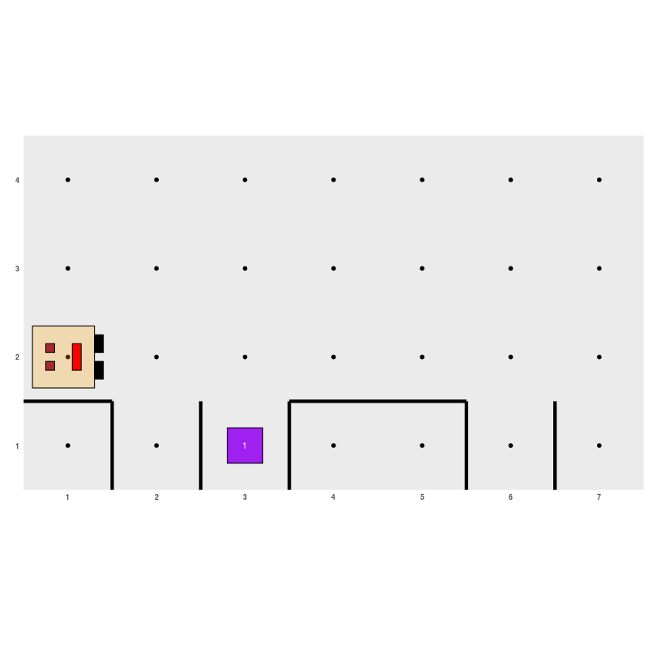

<!-- README.md is generated from README.Rmd. Please edit that file -->

**NOTE: Work in progress**

**NOTA: En construcción**

# Karel la robot aprende R

<!-- badges: start -->

[](https://CRAN.R-project.org/package=karel)
[](https://www.tidyverse.org/lifecycle/#experimental)
[](https://cran.rstudio.com/package=karel)
[](https://codecov.io/gh/r-lib/karel?branch=master)
<!-- badges: end -->

The goal of karel is to …

## Instalación

<!-- 
You can install the released version of karel from [CRAN](https://CRAN.R-project.org) with:

``` r
install.packages("karel")
```
-->

Se puede instalar la versión en desarrollo del paquete `karel` desde
[GitHub](https://github.com/mpru/karel) con:

``` r
# install.packages("devtools")
devtools::install_github("mpru/karel")
```

## Ejemplo

Mientras construyo las viñetas completas, podés ir viendo un mini
ejemplo:

``` r
library(karel)

# Crear un mundo para Karel
generar_mundo("world_106")
```


``` r

# Crear mi propia función
llenar_agujero <- function() {
  girar_derecha()
  avanzar()
  if (no_hay_cosos()) {
    poner_coso()
  }
  darse_vuelta()
  avanzar()
  girar_derecha()
}

# Usarla para que Karel pueda llenar todos los agujeros
while (frente_abierto()) {
  if (derecha_abierto()) {
    llenar_agujero()
  }
  avanzar()
}
if (derecha_abierto()) {
  llenar_agujero()
}
ejecutar_acciones()
```


