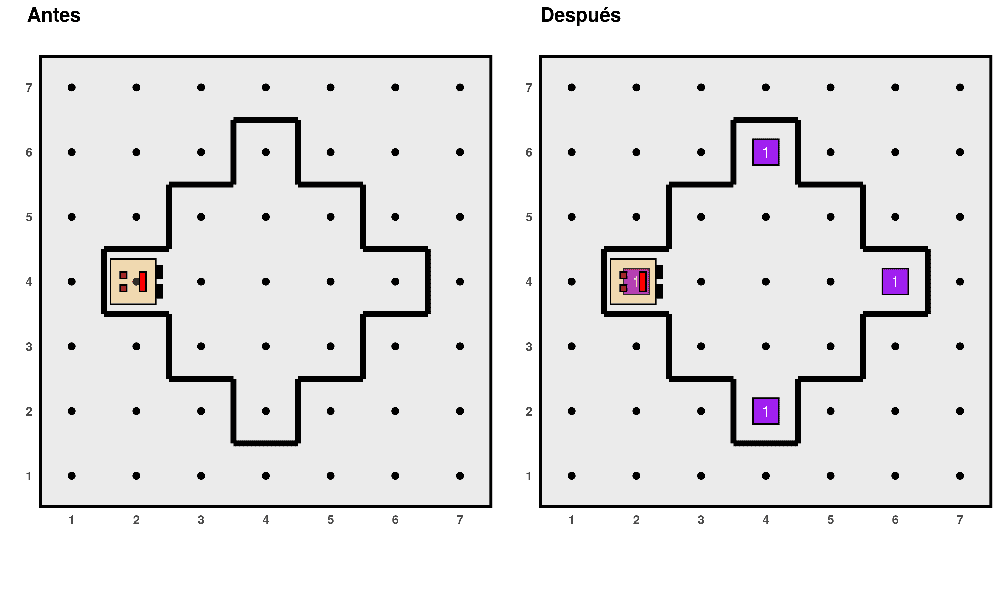

```{r, include = FALSE}
knitr::opts_chunk$set(
  collapse = TRUE,
  comment = "#>",
  fig.align = "center"
)
```

## Who is Karel?

`karel` is an R package created with the purpose of providing an environment that enables the teaching of programming principles in a dynamic and interactive way, for students with no previous experience who are studying at the secondary level or in the early years of their undergraduate education. *Karel* is a robot that lives and walks in certain *worlds*, in which it can perform certain actions if we ask it to, while we learn to program in R.

The robot Karel assists in the teaching of fundamental programming concepts, such as the processor (Karel), environment (its world), objects (called *beepers*), and actions (the activities it can perform). In addition, as can be seen in the examples of the tutorials presented on this page, along with Karel, it is possible to instruct on the concept of algorithmic decomposition: on numerous occasions, the robot must fulfill objectives whose resolution requires breaking down the problem into smaller parts, for each of which students must program a function in R. It also facilitates the exemplification of the use of sequential code control structures, conditionals (`if () {} else {}`), and iterative structures (`for () {}`, `while () {}`).

The first step to programming with Karel is to *generate a world* in which it can move, using the instruction `generate_world()`, specifying the name of the world we want to use within the parentheses. The package includes a few predefined worlds, but users can choose to create new ones.

All of Karel's worlds are rectangular, composed of streets that run horizontally (rows) and vertical avenues (columns). Karel is always located at the intersection of a street and an avenue (cell), facing one of the four possible directions: east, north, west, or south. The black borders represent walls that Karel cannot cross; it can only go around them. Additionally, in some cells, there are one or several *beepers*. Karel can traverse the world by picking up and placing *beepers*; if it picks them up, it stores them in its backpack and keeps track of how many it has. Finally, Karel can only perform the following activities: `move()`, `turn_left()`, `pick_beeper()` (pick up coso), and `put_beeper()`. However, by cleverly combining these basic actions, new ones can be created. For example, a function `turn_right()` can be created by making Karel turn left three times. Furthermore, Karel is capable of evaluating certain characteristics of its environment through functions that return a logical value `TRUE` or `FALSE`, for example: `front_is_clear()` (front open), `beepers_present()` or `facing_south()`. This allows us to condition the actions that Karel performs based on certain aspects of its position and its world. Once the code with all the actions that Karel must perform is executed, the function `run_actions()` must be run, and the result can be seen in an animation created with the `ggplot` and `gganimate` packages.

In order to overcome some of the language barriers that can make taking the first steps in learning programming more challenging, the `karel` package was designed to be completely bilingual: all functions have a version in Spanish and English (for example, `girar_izquierda()` and `turn_left()`), and the help manual pages and some website pages are written in both languages.

The idea for the implementation of this package is based on *Karel the Robot*, a programming language created for educational purposes by Dr. R. E. Pattis from Stanford University (California, USA), who also wrote the book *Karel the Robot: A Gentle Introduction to the Art of Programming* in 1981. Its name pays homage to Karel Capek, the Swedish writer who coined the word "robot" in his science fiction work *R.U.R. (Rossum's Universal Robots)*. Its syntax was based on Pascal, but over the decades, this teaching strategy has been implemented in different languages such as Java, C++, Ruby, and Python. The package presented here is the first implementation of Karel for R. Some of the examples included in the vignettes are adaptations of those published by Eric Roberts in his material *Karel the robot learns Java* (2005).

## Installation

You can install `karel` from [CRAN](https://CRAN.R-project.org/package=karel):

``` r
install.packages("karel")
```

You can also install the development version from [GitHub](https://github.com/mpru/karel):

``` r
# install.packages("devtools")
devtools::install_github("mpru/karel")
```

## Examples

Can you write a program for Karel to place *beepers* at the vertices of the diamond it is enclosed in?

```{r, echo=F, out.width="60%"}

```

Maybe doint this?

```{r, eval = FALSE}
# Load the package and Karel's superpowers
library(karel)
load_super_karel()

# Create new functions
walk_diagonal <- function() {
	while (front_is_clear()) {
		move()
		turn_left()
		move()
		turn_right()
	}
}

# Solve the problem
generate_world("mundo019")
for (i in 1:4) {
	walk_diagonal()
	put_beeper()
	turn_right()
}
run_actions()
```

```{r, echo=F, out.width="50%"}
if (knitr::is_html_output()) knitr::include_graphics("33.gif")
```

Now Karel is in a maze. Can we make it reach the end?

```{r, echo=F, out.width="50%"}
knitr::include_graphics("29.png")
```

Yes, with this code:

```{r, eval=F}
generate_world("mundo009")
while (no_beepers_present()) {
  turn_right()
  while (front_is_blocked()) {
    turn_left()
  }
  move()
}
run_actions()
```

```{r, echo=F, out.width="50%"}
if (knitr::is_html_output()) knitr::include_graphics("30.gif")
```

You can see more details about these examples and others in the tutorials section.
