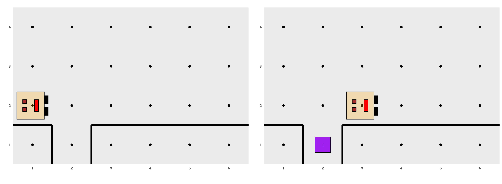

```{r, include = FALSE}
knitr::opts_chunk$set(
  collapse = TRUE,
  comment = "#>", out.width = "60%", fig.align = "center"
)
```

Un principio fundamental en la resolución de un problema es intentar descomponerlo en partes más pequeñas, que puedan ser más fáciles de afrontar. Este concepto también se aplica en la programación. Nuestros algoritmos pueden descomponerse en **subalgoritmos** que den solución a un aspecto del problema, de menor extensión. Este proceso se conoce como **descomposición algorítmica** o **descomposición modular**. Cada subalgoritmo debe ser independiente de los demás y a su vez podría seguir descomponiéndose en partes más sencillas en lo que se conoce como **refinamiento sucesivo**. Si un programa es muy largo se corre el riesgo de que sea muy difícil de entender como un todo, pero siempre se lo puede dividir en secciones más simples y manejables. Un subalgoritmo se escribe una vez y luego es utilizado por todos aquellos algoritmos que lo necesiten. 

Cada vez que, como parte de la resolución de un problema, desde un algoritmo se solicita que se realicen las acciones establecidas por un subalgoritmo, se dice que se lo está **invocando** o **llamando**. Al algoritmo que invoca a los subalgoritmos a veces le decimos *algoritmo principal* para darle un mayor énfasis a la idea que, desde el curso de acción principal, cada tanto se delega la ejecución de algunas tareas al subalgoritmo.

El empleo de subalgoritmos, desarrollando por separado ciertas partes del problema, resulta especialmente ventajoso en los casos siguientes:

- **En algoritmos complejos**: si el algoritmo, y luego el programa, se escribe todo seguido y en un único archivo de código, resulta muy complicado de entender, porque se pierde la visión de su estructura global dada la gran cantidad de operaciones que lo conforman. Aislando ciertas partes como subalgoritmos separados se reduce la complejidad.
- **Cuando se repiten operaciones análogas**: si la resolución de un problema requiere realizar una tarea que se repite varias veces en el algoritmo, podemos definir dicha tarea como un subalgoritmo por separado. De esta manera, su código se escribirá sólo una vez aunque se use en muchos puntos del programa. 

En el mundo de la programación existen muchos términos para definir distintos tipos de subalgoritmos: subrutinas, funciones, procedimientos, métodos, subprogramas, etc. No es posible obtener una definición que capture todas las variantes que existen en el uso de estos términos debido a que el significado de cada uno de ellos varía según el paradigma
^[Se usa el término paradigma de programación para clasificar a los lenguajes según sus características. En [este link](https://hackr.io/blog/programming-paradigms) se puede encontrar una breve descripción de los principales paradigmas de programación] 
y el lenguaje de programación escogidos. Qué se entiende por cada uno de ellos depende muchas veces del paradigma de programación empleado y del lenguaje escogido, por lo cual no existe una definición lo suficientemente general para cada uno.

A lo largo de este tutorial y mientras usemos R, a los subalgoritmos los llamaremos **funciones** y por ahora las utilizaremos con el objetivo de ayudar en la modularidad del programa.

## Girar a la derecha

Para empezar con algo sencillo, en el ejemplo visto en la sección anterior Karel necesitaba doblar a la derecha y lo logramos indicándole que gire tres veces a la izquierda. Esto es medio molesto, primero porque mentalmente nos imaginamos otra cosa cuando queremos que Karel gire a la derecha y segundo porque probablemente Karel tenga que girar a la derecha en muchos problemas y no vamos a querer repetir tantas veces `girar_izquierda()`.

Por eso, es muy razonable crear una nueva función para que se encargue de esto. Cada vez que nos damos cuenta de que estamos usando una secuencia de comandos de Karel con el objetivo de cumplir una tarea específica, como doblar a la derecha, entonces es momento de definir una nueva función que englobe esos comandos:

```{r, eval=FALSE}
girar_derecha <- function() {
  girar_izquierda()
  girar_izquierda()
  girar_izquierda()
}
```

De manera general, en R una función se crea con estos pasos:

1. Elegir nombre: `girar_derecha`
2. Usar el operador de asignación (o *flechita*, `<-`) para asociar a ese nombre la definición de una función.
3. Escribir la instrucción `function() {...}`, donde lo que va entre llaves es el conjunto de acciones que engloba la nueva función, una en cada renglón:

```{r, eval=FALSE}
nombre <- function() {
  ... instrucciones de R ...
}
```

Con la ayuda de este subalgoritmo, podemos apreciar cómo se simplifica la escritura del código. Es importante notar que, para que podamos usar la función `girar_izquierda()`, la misma tiene que ser definida y evaluada por R **antes** de que hagamos uso de la misma para resolver nuestro problema:

```{r, eval=FALSE}
#  --------------- Cargar paquete Karel --------------------
library(karel)

# ------------ Definición de funciones auxiliares-----------

girar_derecha <- function() {
  girar_izquierda()
  girar_izquierda()
  girar_izquierda()
}

# ---------------- Programa principal ----------------------

generar_mundo("mundo001")
avanzar()
juntar_coso()
avanzar()
girar_izquierda()
avanzar()
girar_derecha()
avanzar()
avanzar()
poner_coso()
avanzar()
ejecutar_acciones()
```

```{r, echo=FALSE, fig.align="center"}
if (knitr::is_html_output()) knitr::include_graphics('18.gif')
```

**EJERCICIO**: crear una función llamada `darse_vuelta()` que le permita a Karel realizar un giro de 180 grados y quedar mirando hacia la dirección contraria.

## Los superpoderes de Karel

En la sección anterior hemos creado las funciones `girar_derecha()` y `darse_vuelta()` por nuestros propios medios para aprender cómo generar nuevos subalgoritmos. Sin embargo, para agilizar la creación de nuestros programas y la visualización de lo que hace Karel, el paquete de R trae incorporadas mejores versiones de `girar_derecha()` y `darse_vuelta()`. Para que estén disponibles y las podamos usar, tenemos que activar estos superpoderes de Karel con la siguiente sentencia, que puede ser ejecutada en cualquier momento (luego de `library(karel)` sería un buen lugar):

```{r, eval=FALSE}
library(karel)
cargar_super_karel()
```

## Llenar el agujero

Veamos otro ejemplo sobre la utilidad de la descomposición algorítmica. Como ocurre en muchos lugares, en el mundo de Karel a veces las calles necesitan reparación. Imaginemos que Karel está caminando por la calle como se ve en la figura de la izquierda y se encuentra con un agujero. Su tarea es rellenarlo con un *coso* y avanzar hasta el otro extremo, como se ve en la figura de la derecha.

```{r, out.width='800%', echo=FALSE, fig.align="center"}

```

Si nos limitamos a los comandos básicos de Karel, el programa que permite resolver esto es:

```{r, eval=FALSE}
generar_mundo("mundo002")
avanzar()
girar_izquierda()
girar_izquierda()
girar_izquierda()
avanzar()
poner_coso()
girar_izquierda()
girar_izquierda()
avanzar()
girar_izquierda()
girar_izquierda()
girar_izquierda()
avanzar()
ejecutar_acciones()
```

Si en cambio usamos nuestras propias funciones `girar_derecha()` y `darse_vuelta()`, el programa queda más corto y claro:

```{r, eval=FALSE}
generar_mundo("mundo002")
avanzar()
girar_derecha()
avanzar()
poner_coso()
darse_vuelta()
avanzar()
girar_derecha()
avanzar()
ejecutar_acciones()
```

Ahora bien, el proceso de llenar el agujero es una tarea muy concreta que puede ser pensada como un problema en sí mismo, que se puede resolver por fuera del algoritmo principal. Podemos definir un nuevo subalgoritmo que se encargue específicamente de esto y que pueda ser reutilizado en otras ocasiones. Siguiendo entonces la idea de la descomposición algorítmica, el problema que estamos analizando puede ser descompuesto de esta forma:

```{r, eval=FALSE}
#  --------------- Cargar paquete Karel --------------------

library(karel)
cargar_super_karel() # pone a disposición girar_derecha() y darse_vuelta()

# ------------ Definición de funciones auxiliares-----------

llenar_agujero <- function() {
  girar_derecha()
  avanzar()
  poner_coso()
  darse_vuelta()
  avanzar()
  girar_derecha()
}

# ------------------- Programa principal --------------------
generar_mundo("mundo002")
avanzar()
llenar_agujero()
avanzar()
ejecutar_acciones()
```

```{r,  echo=FALSE, fig.align="center"}
if (knitr::is_html_output()) knitr::include_graphics('20.gif')
```

## Documentación de los subalgoritmos

En el contexto de la programación, documentar significa escribir indicaciones para que otras personas puedan entender lo que queremos hacer en nuestro código o para que sepan cómo usar nuestras funciones. Por ejemplo, como vimos antes todas funciones predefinidas de R están documentadas para que podamos buscar ayuda si la necesitamos. Cuando estamos creando nuestras propios subalgoritmos, es importante que también incluyamos comentarios para guiar a otras personas (y a nosotros mismos en el futuro si nos olvidamos) para qué y cómo se usa lo que estamos desarrollando. Por ejemplo, puede ser bueno que enunciemos el nombre de la función y aclaremos bajo qué condición inicial se puede utilizar y qué resultado final arroja, por ejemplo:

```{r, eval=FALSE}
#  --------------- Cargar paquete Karel --------------------

library(karel)
cargar_super_karel()

# ------------ Definición de funciones auxiliares-----------

# Función: llenar_agujero
# Condición inicial: Karel se encuentra sobre el agujero (en la calle anterior),
# mirando al este
# Condición final: Karel se encuentra en la misma posición que al inicio y ha
# colocado un coso en el agujero
llenar_agujero <- function() {
  girar_derecha()
  avanzar()
  poner_coso()
  darse_vuelta()
  avanzar()
  girar_derecha()
}

# ------------------- Programa principal -------------------
generar_mundo("mundo002")
avanzar()
llenar_agujero()
avanzar()
ejecutar_acciones()
```

*Algunos ejemplos presentados en este tutorial fueron adaptados de Karel the robot learns Java (Eric Roberts, 2005).*
