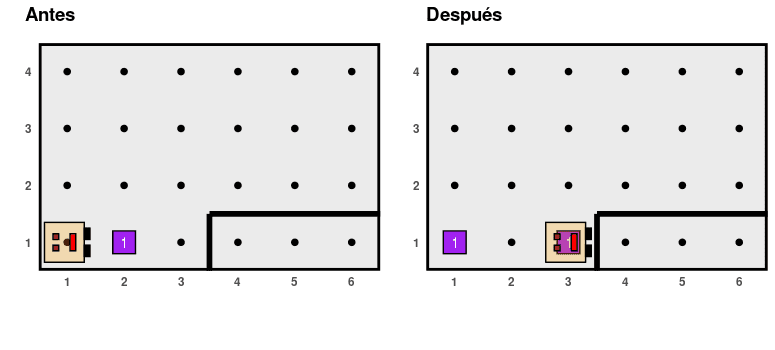
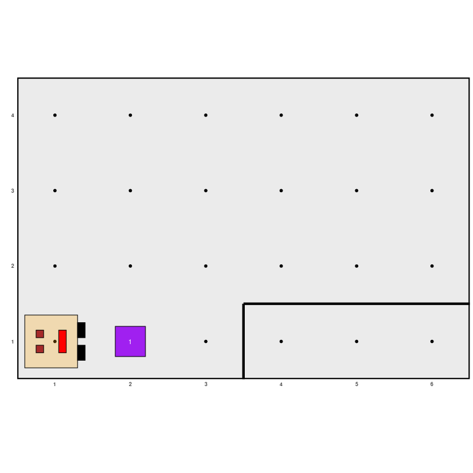
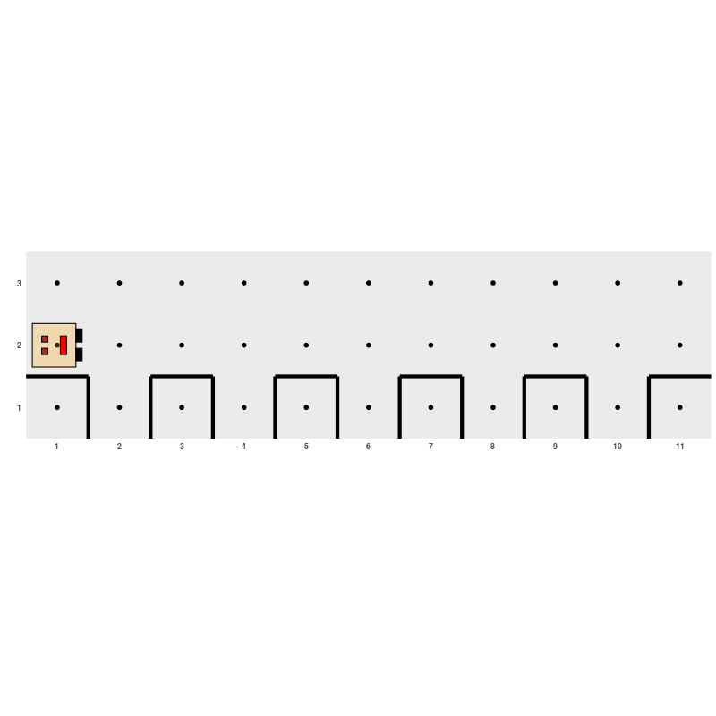
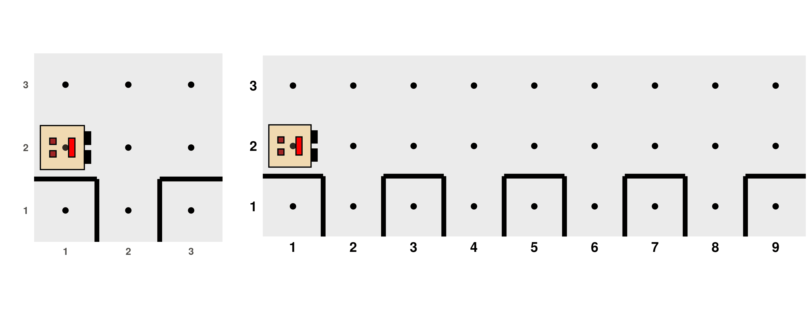

```{r, include = FALSE}
knitr::opts_chunk$set(collapse = TRUE, comment = "", out.width = "60%", 
                      fig.align = "center")
```

As mentioned earlier, an algorithm is composed of an ordered sequence of commands that are executed one after another. However, it is often necessary to use special commands that alter or control the order in which actions are executed. We refer to these rules as **control structures for the flow of actions**, which allow us to control the flow of actions in an algorithm or program. They can be classified as **sequential**, **conditional**, and **iterative** control structures.

## **Sequential Control Structures**

**Sequential control structures** are composed of a defined number of actions that are placed in a specific order and executed one after another. The examples we discussed earlier are formed by this type of structure.

## **Conditional Control Structures**

In certain parts of an algorithm, it may be useful to pause and ask a question because you have reached a situation where there may be one or more options available to continue. Depending on the answer to the question, which must always be **`TRUE`** or **`FALSE`**, the algorithm will follow certain actions and ignore others. These questions and answers represent decision-making processes that lead to different paths within the algorithm, allowing the solution to the problem at hand to be flexible and adapt to different situations. These types of control structures are called **conditional** (or *selection structures*) and can be **simple**, **double**, or **multiple**.

### **Simple Conditional Structures**

They involve a logical evaluation, and if the result is **`TRUE`**, the actions delimited between the braces that define the body of this structure are executed. They are expressed in R with the following syntax:

```{r, eval=FALSE}
if (condition) {
	...code to execute actions...
}
```

The word **`if`** indicates the logical evaluation command, **`condition`** indicates the evaluation to be performed, and the instructions to be executed only if the condition is met, that is, if the evaluation results in **`TRUE`**, are detailed between curly braces. If the condition is not satisfied, no action is executed, and the program continues its sequential structure with the code that follows the last curly brace.

Karel is going to help us illustrate this. The following table shows the logical evaluations that the robot can perform about its world. For example, if we execute the function **`front_is_clear()`**, we will get the value **`TRUE`** if there is indeed no wall in front of Karel, or the value **`FALSE`** if there is a wall.

|     **R Function**     |           **Returns TRUE if\...**           |
|:----------------------:|:-------------------------------------------:|
|    front_is_clear()    |   \...there is no wall in front of Karel.   |
|   front_is_blocked()   |   \...there is a wall in front of Karel.    |
|    left_is_clear()     | \...there is no wall to the left of Karel.  |
|   left_is_blocked()    |  \...there is a wall to the left of Karel.  |
|    right_is_clear()    | \...there is no wall to the right of Karel. |
|   right_is_blocked()   | \...there is a wall to the right of Karel.  |
|   beepers_present()    |    \...there are beepers where Karel is.    |
|  no_beepers_present()  |  \...there are no beepers where Karel is.   |
|  karel_has_beepers()   |  \...Karel has beepers in its beeper bag.   |
| karel_has_no_beepers() | \...Karel has no beepers in its beeper bag. |
|     facing_east()      |          \...Karel is facing east.          |
|     facing_west()      |          \...Karel is facing west.          |
|     facing_south()     |         \...Karel is facing south.          |
|     facing_north()     |         \...Karel is facing north.          |

We can use a conditional structure to modify the **`fill_hole()`** function we created earlier so that Karel only places an item if there wasn't already one in the hole:

```{r, eval=FALSE}
# ------------ Definition of auxiliary functions -----------

fill_hole <- function() {
  turn_right()
  move()
  if (no_beepers_present()) {
    put_beeper()
  }
  turn_around()
  move()
  turn_right()
}

# ------------------- Main program -------------------

generate_world("mundo002")
move()
fill_hole()
run_actions()
```

Note that although the use of indentation in the code is optional, we decided to use it to improve readability. Maintaining clarity in our programs is essential.

### **Double Conditional Structures**

This type of conditional structure adds an action to be executed in case the evaluated condition is not met (i.e., it returns **`FALSE`**). The syntax is:

```{r, eval=FALSE}
if (condition) {
	...code to execute actions...
} else {
	...code to execute actions...
}
```

The first set of curly braces contains the actions to be performed if the condition is met, while the second set, following the **`else`** statement, includes the actions to be performed if the condition is not met.

Let's imagine that we want to create an algorithm to reverse the state of a cell, meaning that Karel puts an item if there isn't one or removes it if there is:

```{r,  echo=FALSE, fig.align="center", eval=TRUE}

```

For this, we can use a double conditional structure:

```{r, eval=FALSE}
generate_world("mundo001")
if (beepers_present()) {
  pick_beeper()
} else {
  put_beeper()
}
move()
if (beepers_present()) {
  pick_beeper()
} else {
  put_beeper()
}
move()
if (beepers_present()) {
  pick_beeper()
} else {
  put_beeper()
}
run_actions()
```

```{r,  echo=FALSE, fig.align="center"}
if (knitr::is_html_output()) 
```

Since we repeat the process of checking whether there is an item or not to decide whether to remove or place one three times exactly the same way, we can once again resort to the principle of algorithmic decomposition and define a function that takes care of this process, making the action of *reversing* the state of a cell simpler. Our code file would look like this:

```{r, eval=FALSE}
# ------------ Definition of auxiliary functions -----------

reverse_state <- function() {
  if (beepers_present()) {
    pick_beeper()
  } else {
    put_beeper()
  }
}

# ------------------- Main program -------------------

generate_world("mundo001")
reverse_state()
move()
reverse_state()
move()
reverse_state()
run_actions()
```

### **Multiple or Nested Conditional Structures**

These structures allow combining multiple conditional structures to establish more complex controls over the flow of actions, representing multiple decision-making points. We can illustrate the syntax as follows:

```{r, eval=FALSE}
if (condition 1) {
	...First set of actions...
} else if (condition 2) {
	...Second set of actions...
} else {
	...Third set of actions...
}
```

In the above structure, there is an initial logical evaluation in which, if the result is **`TRUE`**, the first set of actions is executed exclusively. Otherwise, if the result is **`FALSE`**, a second logical evaluation is performed, leading to the execution of either the second or the third set of actions, depending on whether its result is **`TRUE`** or **`FALSE`**, respectively.

## **Iterative Control Structures**

Iterative control structures are useful when solving a problem requires repeatedly executing a set of actions. The number of times the sequence of actions needs to be repeated can be fixed or variable, depending on some data in the algorithm.

### **Iterative Control Structures with a Fixed Number of Iterations**

These structures are applied when the exact number of times a sequence of actions needs to be repeated is known in advance. For example, consider the following problem where there are holes evenly distributed on even avenues.

```{r, out.width='80%', echo=FALSE, fig.align="center"}
knitr::include_graphics('21.png')
```

We need to write a program for Karel to fill all 5 holes. We could plan something like this:

```{r, eval=FALSE, highlight=FALSE}
# ------------------- Main program -------------------

generate_world("mundo003")
move()
fill_hole()
move()

move()
fill_hole()
move()

move()
fill_hole()
move()

move()
fill_hole()
move()

move()
fill_hole()
move()
run_actions()
```

It is clear that it doesn't make sense to write the exact same code 5 times. Therefore, we can use an iterative structure:

```{r, eval=FALSE}
generate_world("mundo003")
for (i in 1:5) {
  move()
  fill_hole()
  move()
}
run_actions()
```

The letter `i` is used to represent the number of repetitions. In this example, its sole purpose is to guide the series of steps. The block of instructions is repeated as many times as it takes for `i` to reach 5 starting from 1 (this is defined using the `1:5` expression). We could have chosen another letter or another word instead, but using `i` is quite common. In general, the syntax for this type of structure is:

```{r, eval=FALSE, highlight=FALSE}
for (i in <initial_value>:<final_value>) {
	...Actions...
}
```

```{r, echo=FALSE, fig.align="center"}
if (knitr::is_html_output()) 
```

### **Iterative Control Structures with an Indeterminate Number of Iterations**

In other circumstances, it may be necessary to repeat a block of actions without knowing exactly how many times, but rather depending on some other aspect of the ALGORITHM. The iterations can continue **while** a certain condition is true. In this type of structure, the set of instructions is repeated as long as a condition declared at the beginning of the block continues to evaluate as **`TRUE`**. When the condition is no longer met, the process stops. The syntax is:

```{r, eval=FALSE}
while (<condition>) {
	...Actions to repeat...
}
```

Observations:

-   The evaluation of the condition takes place before each iteration, including the first one. If the condition is initially **`FALSE`**, then the actions in the body of the structure are never executed.

-   The evaluation of the condition only takes place at the beginning of each iteration. If the condition becomes **`FALSE`** at some point during the execution of a block, the program does not notice it until the block finishes executing and the condition is evaluated before starting the next iteration.

For example, it would be interesting to write a program to fill holes like the previous one but that works generally for other situations where there may be any number of holes in the street, like these:

```{r, out.width='80%', echo=FALSE, fig.align="center"}

```

Instead of using a **`for`** loop where we have to specify the number of times the process should be repeated, we can use a **`while`** loop so that Karel keeps filling holes as long as there is no wall in front of it, indicating that it has reached the end and should stop.

```{r, eval=FALSE}
# ------------------- Main program -------------------
generate_world("mundo003")
while (front_is_clear()) {
  move()
  fill_hole()
  move()
}
run_actions()
```

Care must be taken when writing this type of structure to ensure that an infinite loop is not created, i.e., an iterative process that never ends. This would occur, for example, if, while being in the previous world, we ask Karel to turn while there are no things where it is standing:

```{r, eval=FALSE}
# Do not run this! (or do, to see how it doesn't work!)
generate_world("mundo003")
while (no_beepers_present()) {
	turn_left()
}
run_actions()
```

*Some examples presented in this tutorial were adapted from "Karel the robot learns Java" (Eric Roberts, 2005).*
