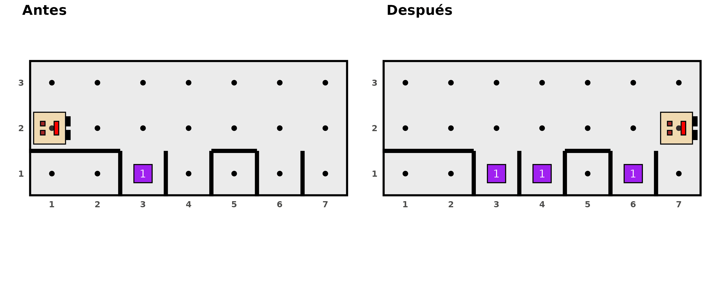
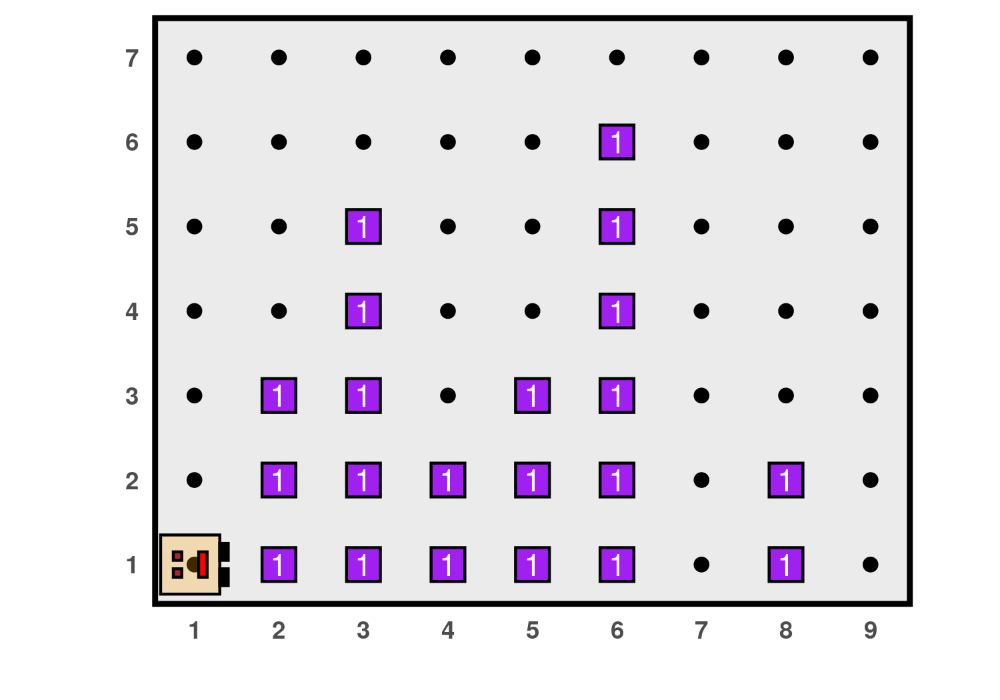
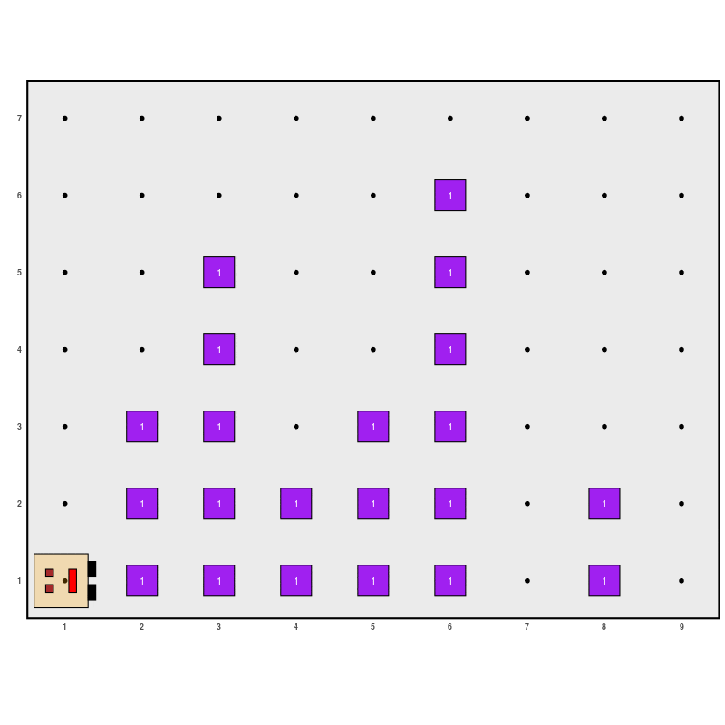
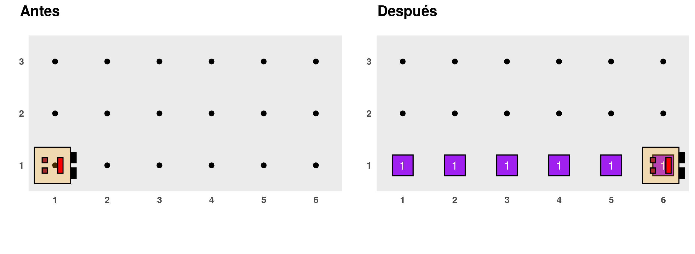
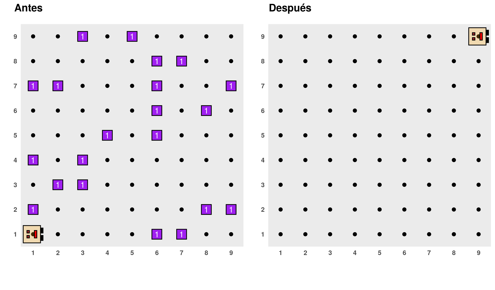
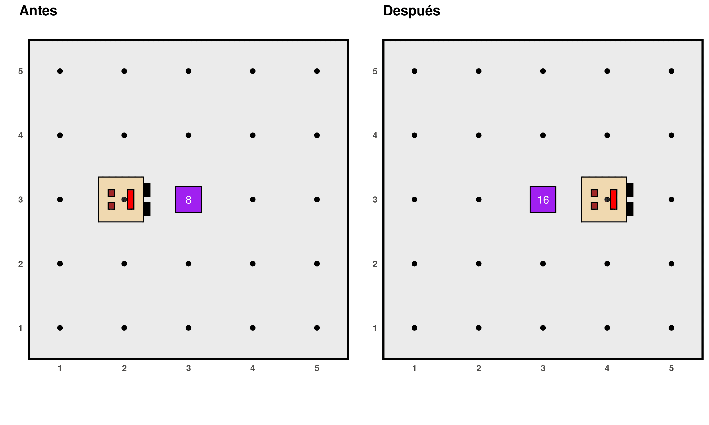

```{r, include = FALSE}
knitr::opts_chunk$set(
  collapse = TRUE,
  comment = "#>", out.width = "60%", fig.align = "center"
)
```

En esta sección presentaremos otros ejemplos que nos ayudarán a seguir pensando en el principio de la descomposición algorítmica y, además, en cómo pensar soluciones que sean lo suficientemente generales para dar respuesta a distintas versiones del mismo problema.

*Algunos ejemplos presentados en este tutorial fueron adaptados de Karel the robot learns Java (Eric Roberts, 2005).*

## Otra vez a reparar la calle

En la sección anterior propusimos el siguiente programa para resolver el problema de llenar los agujeros de la calle:

```{r, eval=FALSE}
# ------------ Definición de funciones auxiliares-----------

# Función: llenar_agujero
llenar_agujero <- function() {
  girar_derecha()
  avanzar()
  if (no_hay_cosos()) {
    poner_coso()
  }
  darse_vuelta()
  avanzar()
  girar_derecha()
}

# ------------------- Programa principal -------------------

generar_mundo("mundo003")
while (frente_abierto()) {
  avanzar()
  llenar_agujero()
  avanzar()
}
ejecutar_acciones()
```

Este programa sirve para mundos con calles de cualquier largo, sin embargo no serviría si los agujeros no estuviesen equiespaciados como asumimos inicialmente. Sería mejor tener un programa más general que funcione bajo estas condiciones:

- El mundo puede tener calles de cualquier largo.
- Los agujeros pueden estar en cualquier posición a lo largo de la calle, sin restricciones en cuanto a la cantidad o su espaciado.
- Algunos agujeros podrían estar ya reparados, de modo que Karel no debe poner un *coso* en ellos.

Un ejemplo de este tipo de mundo es este:

```{r, eval=FALSE}
generar_mundo("mundo006")
```

```{r, out.width='50%', echo=FALSE, fig.align="center"}
knitr::include_graphics('24a.png')
```

Para solucionar este problema, en vez de comenzar cada iteración con un avance, deberíamos primero chequear si donde Karel está parada hay un agujero, si es así llenarlo en el caso de que no estuviese reparado y luego avanzar. Por lo tanto se debe modificar el bloque que se itera:

```{r, eval=FALSE}
# ------------------- Programa principal -------------------

generar_mundo("mundo106")
while (frente_abierto()) {
  if (derecha_abierto()) {
  	llenar_agujero()
  }
	avanzar()
}
ejecutar_acciones()
```

Sin embargo, este programa tiene una falla, porque si bien anda en esta situación...

```{r, out.width='80%', echo=FALSE, fig.align="center"}
knitr::include_graphics('24.png')
```

...no funciona en esta:

```{r, eval=FALSE}
# ------------------- Programa principal -------------------

generar_mundo("mundo007")
while (frente_abierto()) {
  if (derecha_abierto()) {
  	llenar_agujero()
  }
	avanzar()
}
ejecutar_acciones()
```

```{r, out.width='80%', echo=FALSE, fig.align="center"}

```

Karel se detiene sin llenar el último agujero. De hecho, Karel ni siquiera desciende para ver si hay que llenarlo o no. El problema está en que apenas Karel rellena el agujero de la avenida 6, ejecuta la acción de `avanzar`, quedando enfrente de una pared, lo cual hace que el loop `while` se detenga antes de evaluar esa última posición. Este es un error lógico bastante frecuente cuando se trabaja con estructuras iterativas, pero su solución es sencilla. Lo único que tenemos que hacer es agregar un chequeo adicional después de haber finalizado el `while`:

```{r, eval = FALSE}
# ------------------- Programa principal -------------------

generar_mundo("mundo007")
while (frente_abierto()) {
  if (derecha_abierto()) {
  	llenar_agujero()
  }
	avanzar()
}
if (derecha_abierto()) {
	llenar_agujero()
}
ejecutar_acciones()
```

```{r, echo=FALSE, fig.align="center"}
if (knitr::is_html_output()) knitr::include_graphics('26.gif')
```

## Crear otras funciones que hagan de Kareal aún más poderosa

Karel ya sabe girar, avanzar, poner y juntar *cosos*. Sin embargo, podemos imaginar que para desempeñarse en su mundo, seguramente hay algunas actividades que debe repetir a menudo. Por ejemplo, avanzar derechito hasta que se encuentre con una pared, juntar todos los *cosos* que se pueda encontrar a lo largo de una calle o avenida o vaciar su mochila poniendo *cosos* en un lugar hasta que ya no le quede ninguno. Vamos a crear funciones que se encarguen de estas tareas, de modo que Karel pueda implementarlas en cualquier momento.

1. **Avanzar hasta encontrarse con una pared**

  ```{r}
  # Función: avanzar_hasta_pared()
  # Descripción: permite que Karel avance hasta que encuentre una pared
  # Condición inicial: ninguna
  # Condición final: Karel queda enfrentada a una pared
  avanzar_hasta_pared <- function() {
    while (frente_abierto()) {
      avanzar()
    }
  }
  ```


2. **Recolectar una línea de cosos**

  ```{r, eval=FALSE}
  # Función: recolectar_linea()
  # Descripción: permite recolectar una línea consecutiva de cosos. La línea
  # termina en la primera celda que no tiene cosos.
  # Condición inicial: ninguna
  # Condición final: Karel está en el final de la línea con la misma dirección que
  # al inicio
  recolectar_linea <- function() {
    while (hay_cosos()) {
      juntar_coso()
      if (frente_abierto()) {
        avanzar()
      }
    }
  }
  ```

3. **Poner todos los cosos que tiene en la mochila en un lugar**

  ```{r, eval=FALSE}
  # Función: colocar_todo()
  # Descripción: Karel coloca todos los cosos que tiene en su mochila en su
  # posición actual
  # Condición inicial: ninguna
  # Condición final: ninguna
  colocar_todo <- function() {
    while (karel_tiene_cosos()) {
      poner_coso()
    }
  }
  ```

## Recoger columnas de *cosos*

En este ejemplo, no hay paredes en el mundo de Karel pero en algunas avenidas hay columnas de *cosos* de cualquier altura, mientras que otras avenidas están vacías. El trabajo de Karel es recolectarlas a todas, dejarlas en la posición de abajo a la derecha como muestra el diagrama y volver a su posición inicial:

```{r, echo=FALSE, fig.align="center"}

```

Como ya hemos dicho, un buen consejo para encarar cualquier problema es tratar de descomponerlo en partes más pequeñas. Siguiendo esta idea, podemos imaginarnos que el programa principal puede estar compuesto por tres partes: recolectar todos los *cosos* y guardarlos en su mochila que inicialmente estará vacía, depositarlos en la esquina y volver a la posición inicial. Algo como esto:

```{r, eval = FALSE}
generar_mundo("mundo008")
recolectar_todo()
colocar_todo()
volver_inicio()
ejecutar_acciones()
```

Así como está, es muy sencillo entender qué es lo que hay que hacer. Además, hace uso de una función que ya tenemos definida de antes, `colocar_todo()`. Lo único que falta, que no es poco, es escribir los otros dos subalgoritmos, que a su vez pueden descomponerse en otros problemas menores.

En primer instancia, hay que recolectar todas las columnas de *cosos*, sin saber cuántas pueden ser, esto nos hace pensar en que será necesario un `while`. Tenemos que recolectar columna por columna hasta que nos encontremos con la pared:

```{r, eval = FALSE}
recolectar_todo <- function() {
  while (frente_abierto()) {
    recolectar_una_columna()
    avanzar()
  }
  recolectar_una_columna()
}
```

Notar que después del `while` hemos repetido `recolectar_una_columna()`, por la razón expuesta en el ejemplo anterior. Además, le estamos diciendo que recolecte la columna sin haber chequeado si había una... ¿qué pasa si no hay ninguna? Respondé a esta pregunta cuando leas el programa completo más abajo, pero te aseguramos que está bien hacerlo así. 

Claro que entonces necesitamos crear esta nueva función `recolectar_una_columna()`, que tiene que encargarse de que Karel:

1. Gire para mirar hacia el norte.
2. Recolecte todos los *cosos* deteniéndose cuando ya no haya más (¿te suena este problema?.
3. Se dé vuelta para emprender el descenso.
4. Baje hasta la pared que representa al piso (¿te suena este problema?).
5. Vuelva a girar para estar lista para avanzar a la siguiente columna. 

Entonces, la función tiene que ser algo así:

```{r, eval=FALSE}
recolectar_una_columna <- function() {
  girar_izquierda()
  recolectar_linea()
  darse_vuelta()
  avanzar_hasta_pared()
  girar_izquierda()
}
```

Aparecieron por ahí dos funciones que definimos en el ejercicio anterior, que como anticipamos son actividades bastante comunes que nos viene muy bien tenerlas ya programadas. El programa completo se muestra a continuación. Recordar que en R necesitamos ejecutar primero las funciones que hemos inventado y luego el programa principal que las utiliza.

```{r, eval=FALSE}
# ------------ Definición de otras funciones auxiliares-----------

# Función: recolectar_todo()
# Descripción: permite recolectar todos los cosos de cada columna moviéndose a
# lo largo de la primera calle.
# Condición inicial: Karel está mirando al este en la posición (1, 1)
# Condición final: Karel está mirando al este en la posición del extremo derecho
# de la primera fila
recolectar_todo <- function() {
  while (frente_abierto()) {
    recolectar_una_columna()
    avanzar()
  }
  recolectar_una_columna()
}

# Función: recolectar_una_columna()
# Descripción: permite recolectar todos los cosos en una única columna
# Condición inicial: Karel debe estar en la base de la columna mirando al este
# Condición final: Karel está en la misma posición y dirección que al inicio
recolectar_una_columna <- function() {
  girar_izquierda()
  recolectar_linea()
  darse_vuelta()
  avanzar_hasta_pared()
  girar_izquierda()
}

# Función: volver_inicio()
# Descripción: permite que Karel regrese a la posición (1, 1)
# Condición inicial: Karel mira al este en algún lugar de la primera fila
# Condición final: Karel está en la posición (1, 1) mirando al este
volver_inicio <- function() {
  darse_vuelta()
  avanzar_hasta_pared()
  darse_vuelta()
}

# ------------------- Programa principal -------------------
generar_mundo("mundo008")
recolectar_todo()
colocar_todo()
volver_inicio()
ejecutar_acciones()
```

```{r, out.width='80%', echo=FALSE, fig.align="center"}
if (knitr::is_html_output()) 
```

## El laberinto

Ahora nos vamos a imaginar que Karel está en un laberinto como el siguiente, donde el *coso* indica la salida:

```{r,  echo=FALSE, fig.align="center"}
knitr::include_graphics('29.png')
```

Tenemos que crear un programa para que Karel pueda llegar hasta ahí, sin embargo tiene que ser general para que sirva para este y cualquier otro laberinto. Hay una estrategia para resolver cualquier laberinto: si cuando entrás tocás con tu mano la pared a tu derecha y caminás sin dejar de tocarla nunca, eventualmente llegarás a la salida. Esto se conoce como la *regla de la mano derecha* y se traduce en doblar siempre a la derecha, en toda selección de caminos que se te presente (por supuesto, también serviría si se hiciera siempre con la izquierda).

El breve programa que se presenta a continuación implementa el algoritmo de la mano derecha. Muchas veces, los programas que resuelven problemas muy interesantes no son ni largos ni rebuscados. Miralo con atención hasta que estés convencido de entender la lógica de este algoritmo:

```{r, eval = F}
# ------------------- Programa principal -------------------

generar_mundo("mundo009")
while (no_hay_cosos()) {
  girar_derecha()
  while (frente_cerrado()) {
    girar_izquierda()
  }
  avanzar()
}
ejecutar_acciones()
```


```{r, echo=FALSE, fig.align="center"}
if (knitr::is_html_output()) knitr::include_graphics('30.gif')
```

## Más problemas

A continuación se dejan propuestos algunos ejercicios para seguir repasando lo aprendido junto a Karel.

### Problema 1: juntar el periódico {-} 

Para calentar motores, comenzaremos con un problema simple. Imaginemos que Karel está en su casa, la cual es la región cuadrada en el centro del siguiente diagrama:

```{r, out.width='50%', echo=FALSE, fig.align="center"}
knitr::include_graphics('problema_1_1.png')
```

Karel debe salir de su casa para recoger el periódico (representado, obviamente, por un *coso*) y volver a su posición inicial, donde colocará el periódico para ponerse a leer. Vamos a asumir que la casa de Karel (su tamaño, la ubicación de la puerta y del periódico) no sufren cambios, es decir, no hay que generalizar este problema para otras configuraciones posibles del esquema. Escribir el programa en R, de las siguientes formas:

a. En primer lugar, se debe resolver este problema usando solamente las cuatro acciones básicas de Karel (avanzar, girar a la izquierda, poner y juntar *cosos*). 

b. En segundo lugar, resolver el problema empleando el principio de la descomposición algorítmica. Para esto, un subalgoritmo que se encargue de que Karel salga de su casa y otro para que Karel ingrese y regrese a la posición inicial. Usarlos en el algoritmo principal. Además, se puede hacer uso de los superpoderes de Karel (girar a la derecha y darse vuelta), cuyas funciones en R están disponibles si previamente corremos `cargar_super_karel()`.

Utilizar el mundo: `"mundo011"`.

### Problema 2: dar vueltas a la casa {-} 

Ahora vamos a suponer que Karel tiene ejercitarse un poco y para eso va a salir de su casa y dar exactamente tres vueltas alrededor de la misma, en sentido de las agujas del reloj. Escribir el algoritmo y el programa que permiten hacer esto, teniendo en cuenta la estructura del mundo provisto en el problema anterior (`"mundo011"`). Emplear los subalgoritmos creados en el problema 1.b, así como cualquier otro que consideres necesario crear. Karel debe finalizar con la misma posición y dirección que tenía al comienzo.

### Problema 3: crear línea de *cosos* {-} 

Escribir una función para que Karel coloque una línea de *cosos* comenzando en su posición actual y avanzando hasta que encuentre una pared enfrente. Por ejemplo: el resultado de ejecutar esta función en un mundo vacío sería este:

```{r, out.width='80%', echo=FALSE, fig.align="center"}

```

La función debe servir para mundos de cualquier tamaño. Utilizar los mundos: `"mundo012"`, `"mundo013"` y `"mundo014"`.

### Problema 4: saltar los palotes {-} 

Escribir un programa para que Karel pueda saltar palotes como en el siguiente esquema:

```{r, out.width='80%', echo=FALSE, fig.align="center"}
knitr::include_graphics('problema_1_4.png')
```

Algunas consideraciones:

- Karel "salta" los palotes bordeándolos, de a uno por vez.
- Karel comienza en la posición (1, 1) y debe terminar en la (9, 1).
- La solución debe funcionar en mundos que pueden tener distinta cantidad de palotes y de distintos largos, pero siempre con 9 avenidas de ancho.
- Usar los mundos: `"mundo015"` y `"mundo016"`.

### Problema 5: limpiar el mundo {-} 

En este problema tenemos que ayudar a Karel a limpiar su mundo, dado que hay *cosos* dando vuelta por todos lados. Se debe asumir que:

- Karel comienza en la posición (1, 1).
- Inicialmente, cada posición en el mundo puede estar vacía o tener cuanto mucho un *coso* y al finalizar, no debe quedar ningún *coso* en el mundo.
- Karel puede tener cualquier posición y dirección al finalizar.

Por ejemplo, al correr tu programa en el siguiente mundo, este sería el resultado esperado:

```{r, out.width='80%', echo=FALSE, fig.align="center"}

```

Utilizar los mundos: `"mundo017"` y `"mundo018"`.

### Problema 6: poner cosos en los vértices del *rombo* {-}

Escribir un programa para que Karel pueda colocar *cosos* en los vértices del *rombo* en en el cual está encerrada, como se muestra a continuación:

```{r, out.width='80%', echo=FALSE, fig.align="center", eval=TRUE}
knitr::include_graphics('problema1.png')
```

El programa debe funcionar en mundos donde el tamaño del rombo puede ser distinto, pero se puede asumir que Karel siempre inicia posicionada en el vértice que da al oeste, mirando hacia el este. Utilizar los mundos `mundo019` y `mundo020`.

### Problema 7: duplicar el número de *cosos* {-}

Escribir un programa para que Karel pueda duplicar el número de *cosos* que se encuentran en una posición determinada. Por ejemplo:

```{r, out.width='80%', echo=FALSE, fig.align="center", eval=TRUE}

```

Asumir que:

- el mundo siempre luce como en el diagrama anterior (mismo tamaño y sin paredes).
- los *cosos* que deben ser duplicados están siempre en la posición (3, 3) y allí mismo deberá estar el doble de *cosos* al terminar.
- la cantidad inicial de *cosos* en la posición (3, 3) puede ser cualquiera, habiendo siempre al menos uno.
- Karel tiene infinitos *cosos* en su mochila.

El programa principal debe ser:

```{r, eval=FALSE, echo=TRUE}
# Programa principal
generar_mundo("mundo021")
avanzar()
duplicar_cosos()
avanzar()
ejecutar_acciones()
```

Es decir, deberán escribir una función, llamada `duplicar_cosos()` que se encargue de realizar esta tarea, el cual a su vez puede estar descompuesto en otros subalgoritmos. Utilizar el mundo `mundo021`.

### Problema 8: reparar columnas {-}

Karel fue contratada para restaurar las columnas de un antiguo paredón y para esto debe colocarles las piedras que les faltan, representadas obviamente por *cosos*. Es decir, tiene que lograr esto:

```{r, out.width='80%', echo=FALSE, fig.align="center", eval=TRUE}
knitr::include_graphics('problema3.png')
```

Escribir un programa que funcione en el esquema anterior, pero que además sea lo suficientemente general como para que funcione en otros paredones (mundos) que cumplan con las características mencionadas a continuación:

- Karel inicialmente se encuentra en la intersección de Avenida 1 y Calle 1, mirando al este, con una cantidad infinita de *cosos* en su mochila.
- Las columnas están siempre a una distancia de 4 posiciones, en la Avenida 1, 5, 9, etc.
- El final de la secuencia de columnas está determinado por la pared (el borde del mundo) inmediatamente después de la última columna. En el diagrama de ejemplo, termina luego de la Avenida 13, pero podría terminar luego de la 5, 9, 13, 17, etc.
- El borde superior de la columna está determinado por una pared horizontal, pero Karel no debe asumir que la altura de las columnas sea siempre de 5 como en el ejemplo, ni tampoco que todas las columnas tengan la misma altura.
- Algunas partes de las columnas tienen un coso, representando piedras que no necesitan reparación, Karel no debe colocar un segundo coso sobre ellas.
- La posición y dirección final de Karel no importan.

Utilizar los mundos `mundo022`, `mundo023` y `mundo024`.
