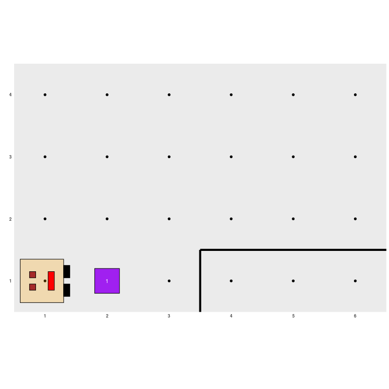

```{r, include = FALSE}
knitr::opts_chunk$set(
  collapse = TRUE,
  comment = "#>",
  out.width='60%'
)
```

Si ya instalaste el paquete `karel`, estamos en condiciones de empezar a usarlo. Vamos a ejecutar la instrucción `library(karel)` para poder usarlo:

```{r, eval=F}
library(karel)
```

Antes que nada tenemos que generar un **mundo** para que Karel pueda andar por ahí. Esto lo hacemos con la instrucción `generar_mundo()`, aclarando entre los paréntesis y con comillas el nombre del mundo que queremos usar. El paquete trae incorporados unos cuantos que iremos explorando, por ejemplo:

```{r, eval=F}
generar_mundo("mundo001")
```

```{r, echo=FALSE, fig.align="center"}
knitr::include_graphics('13.png')
```

Como se puede ver en la imagen, en el mundo de Karel hay algunos elementos:

- Llamamos **calle** a cada fila del mundo rectangular, es decir, las calles corren horizontalmente. 
- Las **avenidas** corren verticalmente (son las columnas). La intersección entre una calle y una avenida es llamada **celda** y se puede identificar por los números fuera del recuadro. 
- Karel está siempre mirando hacia una de las cuatro direcciones posibles: **este**, **norte**, **oeste** o **sur**.
- Los bordes negros representan **paredes**, son barreras que Karel no puede atravezar, sólo puede rodearlas. Tampoco puede atravezar el rectangulo que delimita al mundo (¡no puede salir de él!).
- El cuadrado que se ve en la celda (2, 1) es un **coso**. Karel puede recorrer el mundo poniendo y juntando **cosos** por ahí. En una celda puede haber más de un **coso**, en cuyo caso veremos un número que indica la cantidad de **cosos** presentes.

Además, Karel puede realizar estas actividades:

- `AVANZAR`: se mueve un paso hacia la celda que tiene adelante, si no hay una pared que se lo impida.
- `GIRAR A LA IZQUIERDA`: rota 90 grados hacia su izquierda (sentido contrarreloj).
- `JUNTAR COSO`: levanta el *coso* que hay en su celda y lo guarda en su **mochila**, que es invisible en el diagrama pero puede contener infinitos *cosos*. Debe haber al menos un *coso* en la celda para que Karel pueda realizar esta acción.
- `PONER COSO`: toma un *coso* de su mochila y lo coloca en la celda. Debe haber al menos un *coso* en la mochila de Karel para que pueda realizar esta acción.

Las acciones escritas tal como están arriba son expresiones que podemos entender nosotros, pero para que puedan ser entendidas por Karel, tendremos que respetar las instrucciones con las cuales están implementadas en R:

- `avanzar()`
- `girar_izquierda()`
- `juntar_coso()`
- `poner_coso()`

Los paréntesis indican que las instrucciones anteriores son **funciones** de R, es decir, que las acciones que Karel sabe realizar se ejecutan en R mediante el uso de **funciones**. Si bien más adelante estudiaremos funciones con mayor profundidad, por ahora podemos decir que una **función** es una sección de un programa que cumple con una tarea específica y que tiene un nombre determinado. 

Algunas funciones vienen incorporadas en el lenguaje de programación, por ejemplo, cuando calculamos un logaritmo en la consola de R durante nuestros primeros pasos: `log(27)`. `log` es el nombre de una función que ya viene en R y toma logaritmo del número que está entre paréntesis. Otras funciones se agregan cuando cargamos un paquete, es el caso de las cuatro funciones que mencionamos recién, vienen en el paquete `karel`. Otras funciones son creadas o programadas por las personas, como haremos muy pronto.

Algunas observaciones importantes sobre las funciones que ejecutan las acciones de Karel en R:

- Los paréntesis están vacíos porque R no necesita de información adicional para que estas funciones anden. Ya veremos más adelante que en otros casos no es así y deberemos agregar algunos elementos allí. De hecho, cuando creamos el mundo de Karel con `generar_mundo("mundo001")` ya usamos una función de R que necesita como dato adicional el nombre del mundo a dibujar.
- Estas funciones arrojarán un error en R cuando queremos usarlas sin que corresponda, por ejemplo, si ejecutamos `avanzar()` cuando Karel tiene una pared por delante. Cada vez que cometamos un errror, debemos volver a empezar, incluso generando el mundo otra vez corriendo la instrucción `generar_mundo("mundo001")`.
- R distingue minúsculas de mayúsculas, por eso tenemos que respetar las instrucciones tal como aparecen acá.
- El nombre de una función, por ejemplo, `girar_izquierda`, nunca tiene espacios blancos en el medio (no podría llamarse `GIRAR A LA IZQUIERDA`, sí podría llamarse `girarizquierda`, pero por convención de estilo, las funciones del paquete `karel` tienen nombres con guión bajo de separador).

Por sobre todas las cosas, hay que recordar que estas funciones no andan por sí solas. Siempre tienen que estar precedidas por la ejecución de la función `generar_mundo("mundo001")`, luego corremos todas las acciones de Karel que queramos, pero para poder ver su efecto, tenemos que terminar corriendo la función `ejecutar_acciones()`.

Veamos un primer ejemplo. Vamos a pedirle a Karel que avance, junte el *coso* y vuelva a avanzar:

```{r, eval=FALSE}
# Este programa hace que Karel avance un espacio, junte un coso y vuelva a avanzar
generar_mundo("mundo001")
avanzar()
juntar_coso()
avanzar()
ejecutar_acciones()
```

```{r, echo=FALSE, fig.align="center"}
if (knitr::is_html_output()) 
```

Un problema un poquito más interesante sería que luego de que Karel junte el *coso*, lo coloque en la Calle 2 y Avenida 5 y finalmente avance a la Calle 2 y Avenida 6:

```{r, out.width='100%', echo=FALSE, fig.align="center"}
knitr::include_graphics('15.png')
```

Los primeros tres comandos que necesitamos en el programa son los mismos de antes, pero luego Karel tiene que girar a su izquierda para poder bordear la pared y avanzar un lugar, quedando de cara al norte:

```{r, echo=FALSE, fig.align="center"}
knitr::include_graphics('16.png')
```

Ahora necesitamos que Karel gire a la derecha, para que quede mirando al este. Sin embargo, Karel sólo sabe girar a la izquierda, no existe ninguna función `girar_derecha()`. ¿Puede girar a la derecha usando las acciones disponibles? Claro que sí, ya que se puede lograr el mismo efecto girando tres veces a la izquierda. Luego, sólo resta que avance, coloque el *coso* y vuelva a avanzar una vez:

```{r, eval=FALSE}
generar_mundo("mundo001")
avanzar()
juntar_coso()
avanzar()
girar_izquierda()
avanzar()
girar_izquierda()
girar_izquierda()
girar_izquierda()
avanzar()
avanzar()
poner_coso()
avanzar()
ejecutar_acciones()
```

```{r,  echo=FALSE, fig.align="center"}
if (knitr::is_html_output()) knitr::include_graphics('18.gif')
```

*Algunos ejemplos presentados en este tutorial fueron adaptados de Karel the robot learns Java (Eric Roberts, 2005).*
